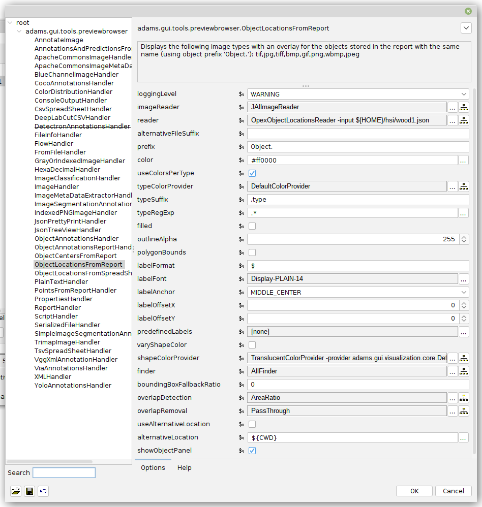

[ADAMS-based](https://adams.cms.waikato.ac.nz/) framework that can be used
for annotating images using its powerful workflow engine.


# Requirements

* OpenJDK 11+

    * Windows: [adoptium.net/temurin](https://adoptium.net/temurin/releases/?version=11)
    * Debian/Ubuntu: `sudo apt install openjdk-11-jdk`
  
  
# Installation

* Download a snapshot (in ZIP format)

    [adams.cms.waikato.ac.nz/snapshots/happy/](https://adams.cms.waikato.ac.nz/snapshots/happy/)
  
* Unzip the ZIP archive and rename the generated directory to `happy-adams`


# Starting the application 

* Start the user interface with:

  * Windows: `happy-adams\bin\start_gui.bat`
  * Linux: `happy-adams/bin/start_gui.sh`
    

# Available flows

Of the flows that are come with the Happy ADAMS framework, the following ones 
are relevant to the Happy project:

* `adams-imaging-annotate_objects.flow` - generating annotations for 
  object detection (bounding box or polygon)
* `adams-imaging-image_segmentation_annotation.flow` - generating annotations 
  for image segmentation (pixel-level classification)
* `adams-imaging-ext_run-sam.flow` - downloads and runs 
  [SAM (Segment Anything Model)](https://github.com/waikato-datamining/pytorch/tree/master/segment-anything) 
  via Docker (can be used within the above two flows as a separate annotation 
  tool) 


# Tutorials

Instructions on how to use these flows are available from the 
[Applied Deep Learning](https://www.data-mining.co.nz/applied-deep-learning/)
website, specifically:

* [object detection](https://www.data-mining.co.nz/applied-deep-learning/object_detection/annotate/)
* [image segmentation](https://www.data-mining.co.nz/applied-deep-learning/image_segmentation/annotate/)


# Preview browser

The *Preview browser* (from the *Visualization* menu) can be used for viewing
PNG/OPEX JSON files that were export from the [envi-viewer](happy_tools/envi-viewer.md)
tool.

Using the *ObjectLocationsFromReport* with the *OpexObjectLocationsReader* you
can generate an overlay of the annotations like this:


The options used can be seen here:



And here as a configuration setup that you can paste via the drop-down button
in the top-right corner of the options dialog:

```
# Project: adams
# Date: 2023-08-23 16:26:05
# User: fracpete
# Charset: UTF-8
# Modules: adams-core,adams-docker,adams-imaging,adams-imaging-ext,adams-json,adams-meta,adams-net,adams-redis,adams-spreadsheet,adams-xml
#
adams.gui.tools.previewbrowser.ObjectLocationsFromReport
	-image-reader
		adams.data.io.input.JAIImageReader
	-reader
		adams.data.io.input.OpexObjectLocationsReader
	-type-color-provider
		adams.gui.visualization.core.DefaultColorProvider
	-label-anchor
	MIDDLE_CENTER
	-shape-color-provider
		adams.gui.visualization.core.TranslucentColorProvider
			-provider
				adams.gui.visualization.core.DefaultColorProvider
	-finder
		adams.data.objectfinder.AllFinder
	-overlap-detection
		adams.data.objectoverlap.AreaRatio
	-overlap-removal
		adams.data.overlappingobjectremoval.PassThrough
	-show-object-panel
	true
```