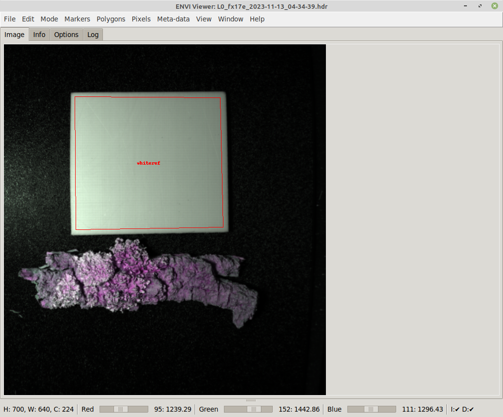

# Menu

In the sections below you can find short explanations of the various menu items.

## File

* Clear all: removes all loaded data and annotations
* Open scan: opens an ENVI scan to view in the Image tab
* Import

    * Pixel annotations: imports pixels annotations from an ENVI file
    * Polygon annotations: imports polygon annotations from an [OPEX JSON](https://github.com/waikato-datamining/fast-opex) file 

* Clear black reference: removes any black reference scan/annotations
* Open black reference: opens an ENVI scan to use as black reference (when using `rl-manual`)
* Import black ref annotations: imports polygon annotations from an [OPEX JSON](https://github.com/waikato-datamining/fast-opex) file
* Clear white reference: removes any white reference scan/annotations
* Open white reference: opens an ENVI scan to use as white reference (when using `rl-manual`)
* Import white ref annotations: imports polygon annotations from an [OPEX JSON](https://github.com/waikato-datamining/fast-opex) file
* Export

    * Image: exports the current as image (PNG/JPG) using the RGB slider settings
    * Pixel annotations: exports the current pixel annotations as ENVI file
    * Polygon annotations: exports the current polygon annotations as [OPEX JSON](https://github.com/waikato-datamining/fast-opex) file
    * Sub-images: allows exporting parts of the scan in various formats (as determined by bounding boxes derived from polygon annotations); useful when multiple samples are present in one image 

* Export options
    
    * Export to scan dir: uses the scan directory as initial directory when exporting annotations or images
    * Overlay annotations: overlays the annotations onto the exported image
    * Keep aspect ratio: keeps the aspect ratio of the scan when exporting the image
    * Enforce MASK_ prefix: prefixes pixel annotations with MASK_ to ensure consistency

* Session:

    * Open: load a session JSON file
    * Save: save the current session data to a JSON file

* Close: closes the viewer application

## Edit

* Undo: performs an undo of markers/annotations/meta-data
* Redo: restores the markers/annotations/meta-data

## Mode

* Polygons: switches to polygon annotation mode
* Pixels: switches to pixel-wise annotation mode

## Markers

* Clear: clears all markers
* Size: for setting the size of the marker circles
* Color: the color to use for the marker circles

## Polygons

* Clear: removes all polygon annotations/markers
* Color: sets the color for the polygon overlays
* Modify: for deleting multiple polygons or changing multiple labels in one go
* Add polygon: creates a polygon from the markers, if there are at least three 
* Min object size: the minimum object size that objects detected by SAM must have (applied to width and height)
* Run SAM: uses the current marker(s) as guidance point(s) for SAM to obtain outline detections 

## Pixels

* Clear: removes all pixel annotations
* Brush shape: square or round
* Brush color: black or white
* Brush size: lets the user choose the size of the brush
* Change alpha: the alpha value to use for the annotation overlay (0: transparent, 255: oaque)
* Select label: the label index determines the pixel value (0: background, >0: the label indices)
* Label key: generates a quick overview of the colors for the specified labels

## Meta-data

The meta-data managed with this menu will be exported with the polygon annotations.

* Clear: removes all meta-data
* Set: allows the user to enter a key-value pair
* Remove: allows the user to remove key-value pairs one at a time 
* View: displays the currently set meta-data in a dialog

## View

* Options

    * Show pixel annotations: when checked any pixel annotations will be overlaid
    * Show polygon annotations: when checked any polygon annotations will be overlaid

* Display spectra (raw): displays the spectra associated with the currently selected markers
* Display spectra (processed): displays the spectra of the processed data (after black/white ref and preprocessing has been applied)
* Zoom: allows various zoom levels (including custom level) or best fit  

## Window

* New window: starts a new Viewer process, using the same options that the current one was started with
* Half width: resizes the window to half of the screen width, useful when comparing two scans horizontally
* Half height: resizes the window to half of the screen height, useful when comparing two scans vertically

## Help

The menu items will open browser windows to web pages with relevant information.


# Overview

## Image tab

Via *File -> Open scan...*, you can load an ENVI file representing a sample scan for viewing.

Depending on your locators for the black/white references, you may need
to load the black/white reference ENVI files manually. Some black/white
reference methods rely on 
From that menu, you can also open black and white reference ENVI files that
get applied to the scan, according to the :


At the bottom of the window, you get a quick info on what dimensions the
scan has (width, height and channels). 

The three sliders allow you to select the channels from the hyperspectral 
image to act as red, green and blue channel for the fake RGB image that is 
being displayed. Left-clicking on the label next to the slider, depicting
the current channel value, pops up a dialog for entering a specific channel.
If *default bands* are defined in the ENVI header and *auto-detect channels*
is enabled on the *Options tab*, then these will get used when loading the
file.


## Info tab

On the *Info* tab, you can see what files are currently loaded and what 
dimensions these files have:


## Options tab

On the *Options* tab, you can change various settings:

* General
  
    * Auto-detect channels: uses any suggested channels from the meta-data of a scan
    * Keep aspect ratio: whether to maintain width/height ratio of the scan or let the image fill the available canvas space
    * Check scan dimensions: when checked and the dimensions of a subsequently loaded scan differs, a warning dialog will be displayed
    * Predefined labels: comma-separated list of labels to use in the annotation process 

* [SAM](../sam.md) connection parameters
* black reference [location](https://github.com/wairas/happy-tools/tree/main/plugins#reference-locators) and [method](https://github.com/wairas/happy-tools/tree/main/plugins#black-reference-methods) plugin
* white reference [location](https://github.com/wairas/happy-tools/tree/main/plugins#reference-locators) and [method](https://github.com/wairas/happy-tools/tree/main/plugins#white-reference-methods) plugin
* [Preprocessing](https://github.com/wairas/happy-tools/tree/main/plugins#happy-data-preprocessors) plugins
* [Normalization](https://github.com/wairas/happy-tools/tree/main/plugins#normalizations) plugin (gets applied before creating RGB image)


# Annotations

The Envi Viewer supports two types of annotations that can be exported:

* pixel-level: for disjointed/scattered regions of interest, e.g., ragged outlines of plants
* polygon-based: for well-defined shapes, like white references or shards of materials

What type of annotations is active is managed via the *Mode* menu, where you
can choose between *Pixels* and *Polygons*.

## Markers

Regardless of annotation mode, *markers* can be set on the scan image, as these
markers are used as points of interest for displaying raw/processed spectra.

* left-clicking on the image sets a marker point.
* left-clicking while holding the CTRL key removes any marker points.


## Pixels

Ensure that you have switched to *Pixels* mode.

TODO

## Polygons

Ensure that you have switched to *Polygons* mode.

Polygons get created from markers as follows:

1. Add markers in clockwise order where the vertices of the polygon should be, 
   e.g., for outlining the white reference in the scan below:

   

2. With at least three markers present, press CTRL+P or choose *Add polygon* 
   from the *Polygons* menu to turn the markers into a polygon:

   

3. You can assign a label to a polygon by left-clicking on the polygon while
   holding the SHIFT key. The labels `whiteref` and `blackref` are reserved
   keywords and used for white/black reference annotations. The labels available
   from the dropdown list are based on the predefined labels from the *Options* tab.

   

4. Once a label has been selected and the dialog accepted, the label will be displayed
   in the center of the polygon:

   


## SAM

Using [SAM](../sam.md), you can easily annotate complex shapes accurately.
Though SAM can run on a CPU, it is recommended to use a computer with a
NVIDIA GPU as it will speed up the detection process by at least 10 times.

SAM requires you to at least provide a single marker on the object that you
want to trace the shape for. Depending on the object and how well it is 
separated from the background, how much the colors on the object change, you
may have to provide more than one marker point to better guide the detection:


The result looks then like this:


# Command-line

Using the command-line options, you can preset the options in the user interface
and also load scan, black and white reference files:

```
usage: happy-envi-viewer [-h] [-s SCAN] [-f BLACK_REFERENCE]
                         [-w WHITE_REFERENCE] [-r INT] [-g INT] [-b INT]
                         [--autodetect_channels] [--no_autodetect_channels]
                         [--keep_aspectratio] [--no_keep_aspectratio]
                         [--check_scan_dimensions]
                         [--no_check_scan_dimensions] [--export_to_scan_dir]
                         [--annotation_color HEXCOLOR]
                         [--predefined_labels LIST] [--redis_host HOST]
                         [--redis_port PORT] [--redis_pw PASSWORD]
                         [--redis_in CHANNEL] [--redis_out CHANNEL]
                         [--redis_connect] [--no_redis_connect]
                         [--marker_size INT] [--marker_color HEXCOLOR]
                         [--min_obj_size INT] [--black_ref_locator LOCATOR]
                         [--black_ref_method METHOD]
                         [--white_ref_locator LOCATOR]
                         [--white_ref_method METHOD]
                         [--preprocessing PIPELINE]
                         [--log_timestamp_format FORMAT] [--zoom PERCENT]
                         [--normalization PLUGIN]
                         [-V {DEBUG,INFO,WARNING,ERROR,CRITICAL}]

ENVI Hyperspectral Image Viewer. Offers contour detection using SAM (Segment-
Anything: https://github.com/waikato-datamining/pytorch/tree/master/segment-
anything)

optional arguments:
  -h, --help            show this help message and exit
  -s SCAN, --scan SCAN  Path to the scan file (ENVI format) (default: None)
  -f BLACK_REFERENCE, --black_reference BLACK_REFERENCE
                        Path to the black reference file (ENVI format)
                        (default: None)
  -w WHITE_REFERENCE, --white_reference WHITE_REFERENCE
                        Path to the white reference file (ENVI format)
                        (default: None)
  -r INT, --scale_r INT
                        the wave length to use for the red channel (default:
                        None)
  -g INT, --scale_g INT
                        the wave length to use for the green channel (default:
                        None)
  -b INT, --scale_b INT
                        the wave length to use for the blue channel (default:
                        None)
  --autodetect_channels
                        whether to determine the channels from the meta-data
                        (overrides the manually specified channels) (default:
                        None)
  --no_autodetect_channels
                        whether to turn off auto-detection of channels from
                        meta-data (default: None)
  --keep_aspectratio    whether to keep the aspect ratio (default: None)
  --no_keep_aspectratio
                        whether to not keep the aspect ratio (default: None)
  --check_scan_dimensions
                        whether to compare the dimensions of subsequently
                        loaded scans and output a warning if they differ
                        (default: None)
  --no_check_scan_dimensions
                        whether to not compare the dimensions of subsequently
                        loaded scans and output a warning if they differ
                        (default: None)
  --export_to_scan_dir  whether to export images to the scan directory rather
                        than the last one used (default: None)
  --annotation_color HEXCOLOR
                        the color to use for the annotations like contours
                        (hex color) (default: None)
  --predefined_labels LIST
                        the comma-separated list of labels to use (default:
                        None)
  --redis_host HOST     The Redis host to connect to (IP or hostname)
                        (default: None)
  --redis_port PORT     The port the Redis server is listening on (default:
                        None)
  --redis_pw PASSWORD   The password to use with the Redis server (default:
                        None)
  --redis_in CHANNEL    The channel that SAM is receiving images on (default:
                        None)
  --redis_out CHANNEL   The channel that SAM is broadcasting the detections on
                        (default: None)
  --redis_connect       whether to immediately connect to the Redis host
                        (default: None)
  --no_redis_connect    whether to not immediately connect to the Redis host
                        (default: None)
  --marker_size INT     The size in pixels for the SAM points (default: None)
  --marker_color HEXCOLOR
                        the color to use for the SAM points (hex color)
                        (default: None)
  --min_obj_size INT    The minimum size that SAM contours need to have (<= 0
                        for no minimum) (default: None)
  --black_ref_locator LOCATOR
                        the reference locator scheme to use for locating black
                        references, eg rl-manual (default: None)
  --black_ref_method METHOD
                        the black reference method to use for applying black
                        references, eg br-same-size (default: None)
  --white_ref_locator LOCATOR
                        the reference locator scheme to use for locating
                        whites references, eg rl-manual (default: None)
  --white_ref_method METHOD
                        the white reference method to use for applying white
                        references, eg wr-same-size (default: None)
  --preprocessing PIPELINE
                        the preprocessors to apply to the scan (default: None)
  --log_timestamp_format FORMAT
                        the format string for the logging timestamp, see: http
                        s://docs.python.org/3/library/datetime.html#strftime-
                        and-strptime-format-codes (default: [%H:%M:%S.%f])
  --zoom PERCENT        the initial zoom to use (%) or -1 for automatic fit
                        (default: -1)
  --normalization PLUGIN
                        the normalization plugin and its options to use
                        (default: norm-simple)
  -V {DEBUG,INFO,WARNING,ERROR,CRITICAL}, --logging_level {DEBUG,INFO,WARNING,ERROR,CRITICAL}
                        The logging level to use. (default: WARN)
```
