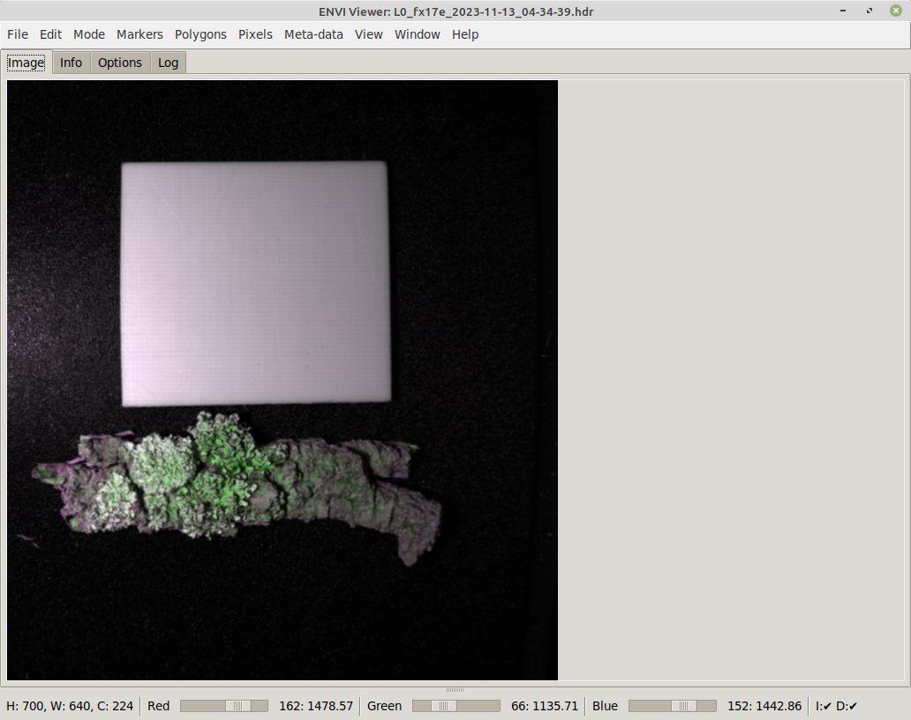
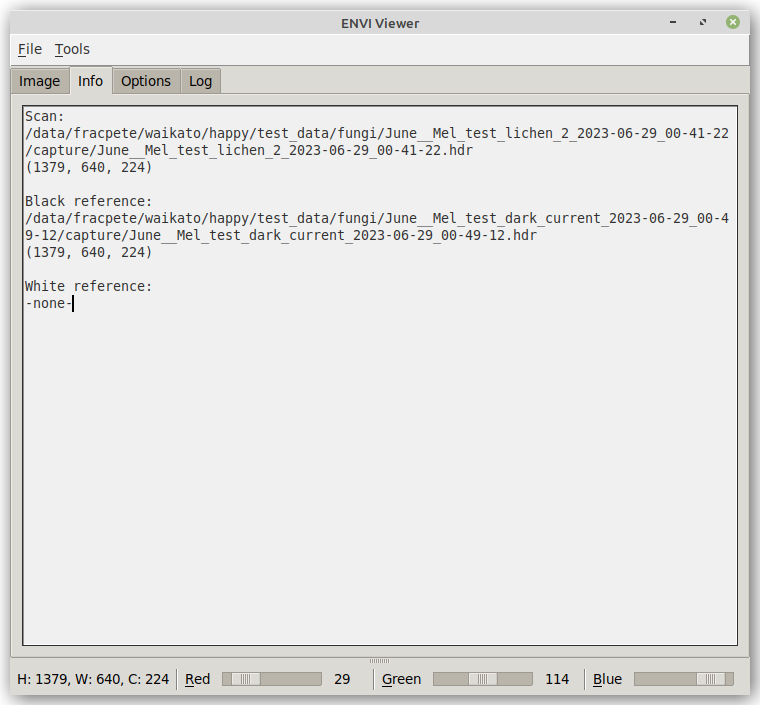
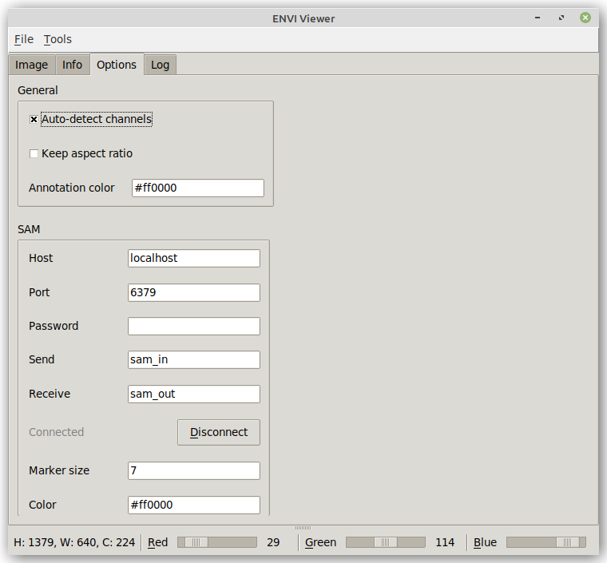
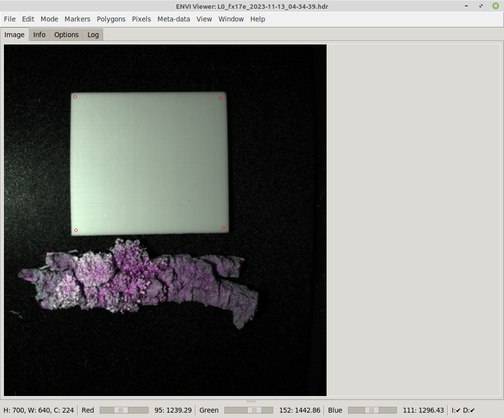
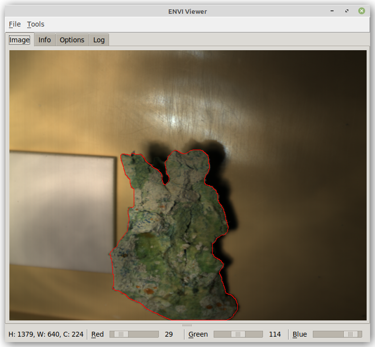

# Usage

## Image tab

Via the *File* menu, you can load an ENVI file representing a sample scan.

From that menu, you can also select black and white reference ENVI files that
get automatically applied to the scan:



At the bottom of the window, you get a quick info on what dimensions the
scan has (width, height and channels). 

The three sliders allow you to select the channels from the hyper-spectral 
image to act as red, green and blue channel for the fake RGB image that is 
being displayed. Left-clicking on the label next to the slider, depicting
the current channel value, pops up a dialog for entering a specific channel.
If *default bands* are defined in the ENVI header and *auto-detect channels*
is enabled on the *Options tab*, then these will get used when loading the
file.


## Info tab

On the *Info* tab, you can see what files are currently loaded and what 
dimensions these files have:




## Options tab

On the *Options* tab, you can change various view settings, how to connect
to [SAM](../sam.md) and how annotations appear:




## Annotations

The envi-viewer also allows you to annotate images and then export them.
The image will be exported as PNG using the currently selected channels.
Any annotations present will get exported as JSON, using the 
[OPEX format](https://github.com/WaikatoLink2020/objdet-predictions-exchange-format). 
Such annotations in OPEX format can be viewed in the ADAMS *Preview browser*.

General mouse usage:

* Left-clicking on the image sets a marker point.
* Left-clicking while holding the CTRL key removes any marker points.
* Left-clicking on an existing annotation shape while holding the SHIFT key
  allows you to enter a label for that shape (e.g., `white_ref` or `leaf`).

Tools menu:

* *Clear annotations* - removes any annotations
* *Clear markers* - removes all marker points
* *Remove last annotation* - removes the most recent annotation that was added 
  (can be repeated till there are no more annotations)
* *Polygon* - turns current marker points into polygon
* *SAM* - uses current marker points as prompt points for [SAM](../sam.md)

### Polygons

The simplest way of annotating that does not require any further tools is by
using polygons. First define the outline of the object with marker points: 



Once at least three marker points have been put on the image, selecting 
*Polygon* from the *Tools* menu turns them into a polygon annotation:


### SAM

Using [SAM](../sam.md), you can easily annotate complex shapes accurately.
Though SAM can run on a CPU, it is recommended to use a computer with a
NVIDIA GPU as it will speed up the detection process by at least 10 times.

SAM requires you to at least provide a single marker on the object that you
want to trace the shape for. Depending on the object and how well it is 
separated from the background, how much the colors on the object change, you
may have to provide more than one marker point to better guide the detection:


The result looks then like this:




# Command-line

Using the command-line options, you can preset the options in the user interface
and also load scan, black and white reference files:

```
usage: happy-envi-viewer [-h] [-s SCAN] [-f BLACK_REFERENCE]
                         [-w WHITE_REFERENCE] [-r INT] [-g INT] [-b INT]
                         [--autodetect_channels] [--keep_aspectratio]
                         [--annotation_color HEXCOLOR] [--redis_host HOST]
                         [--redis_port PORT] [--redis_pw PASSWORD]
                         [--redis_in CHANNEL] [--redis_out CHANNEL]
                         [--redis_connect] [--marker_size INT]
                         [--marker_color HEXCOLOR] [--min_obj_size INT]

ENVI Hyper-spectral Image Viewer. Offers contour detection using SAM (Segment-
Anything: https://github.com/waikato-datamining/pytorch/tree/master/segment-
anything)

optional arguments:
  -h, --help            show this help message and exit
  -s SCAN, --scan SCAN  Path to the scan file (ENVI format) (default: None)
  -f BLACK_REFERENCE, --black_reference BLACK_REFERENCE
                        Path to the black reference file (ENVI format)
                        (default: None)
  -w WHITE_REFERENCE, --white_reference WHITE_REFERENCE
                        Path to the white reference file (ENVI format)
                        (default: None)
  -r INT, --scale_r INT
                        the wave length to use for the red channel (default:
                        None)
  -g INT, --scale_g INT
                        the wave length to use for the green channel (default:
                        None)
  -b INT, --scale_b INT
                        the wave length to use for the blue channel (default:
                        None)
  --autodetect_channels
                        whether to determine the channels from the meta-data
                        (overrides the manually specified channels) (default:
                        None)
  --keep_aspectratio    whether to keep the aspect ratio (default: None)
  --annotation_color HEXCOLOR
                        the color to use for the annotations like contours
                        (hex color) (default: None)
  --redis_host HOST     The Redis host to connect to (IP or hostname)
                        (default: None)
  --redis_port PORT     The port the Redis server is listening on (default:
                        None)
  --redis_pw PASSWORD   The password to use with the Redis server (default:
                        None)
  --redis_in CHANNEL    The channel that SAM is receiving images on (default:
                        None)
  --redis_out CHANNEL   The channel that SAM is broadcasting the detections on
                        (default: None)
  --redis_connect       whether to immediately connect to the Redis host
                        (default: None)
  --marker_size INT     The size in pixels for the SAM points (default: None)
  --marker_color HEXCOLOR
                        the color to use for the SAM points (hex color)
                        (default: None)
  --min_obj_size INT    The minimum size that SAM contours need to have (<= 0
                        for no minimum) (default: None)
```
