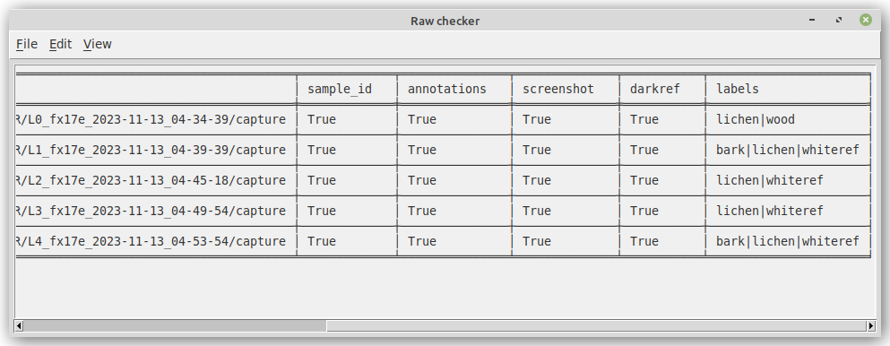

# Main window

The *Raw checker* user interface performs some sanity checks on the *capture*
folders containing the raw data. These checks are then displayed for the user,
allowing them to check whether folders have been left out from annotating or
whether incorrect label names were used.



**File** menu:

* *Select dir...* - the directory to analyze
* *Save output...* - for saving an analysis to a file

**Edit** menu:

* *Copy* - copies the currently displayed output to the clipboard

**View** menu:
 
* *Output format...* - for selecting the type of output to generate


# Command-line

```
usage: happy-raw-checker [-h] [-d RAW_DIR] [-f {text,text-compact,csv,json}]

Raw data checker interface. For sanity checks of raw capture data.

optional arguments:
  -h, --help            show this help message and exit
  -d RAW_DIR, --raw_dir RAW_DIR
                        The initial directory (default: None)
  -f {text,text-compact,csv,json}, --output_format {text,text-compact,csv,json}
                        The output format to use in the text box. (default:
                        text)
```
