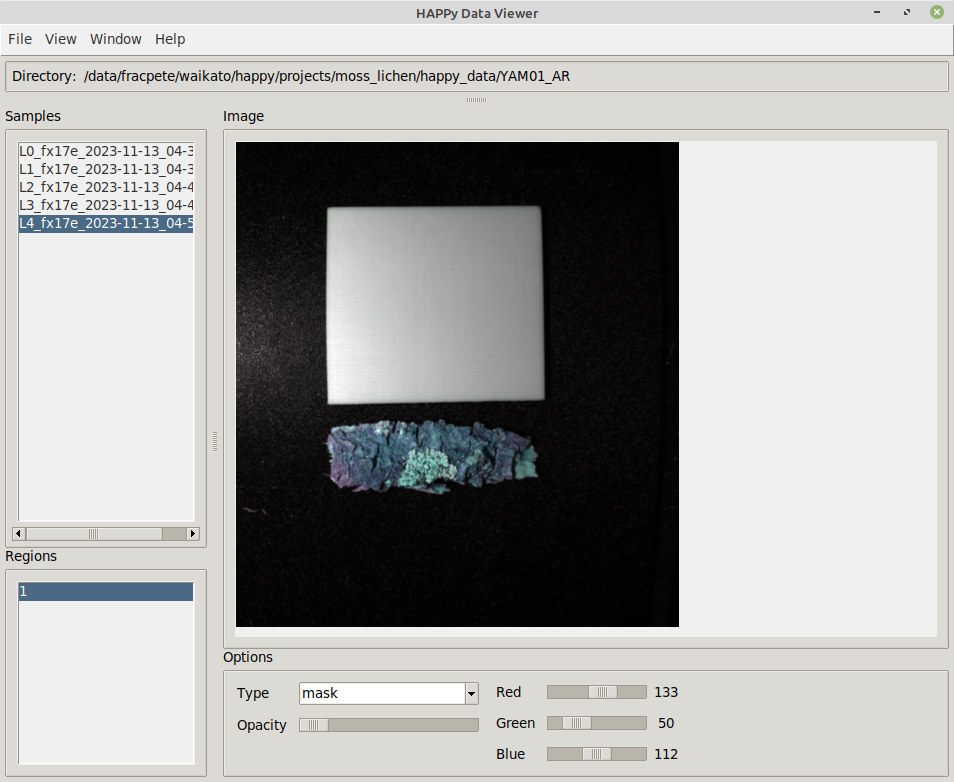
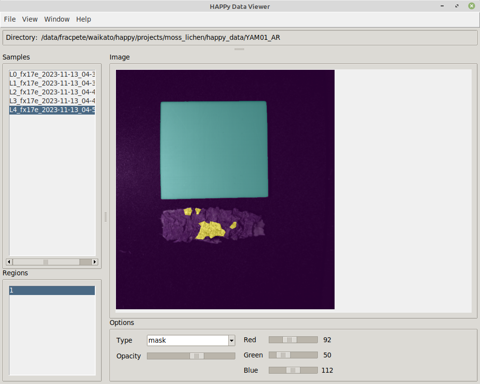

Used for viewing data that has been converted into a HAPPy folder structure.

# Menu

* File 

    * Open dir: for opening HAPPy directories
    * Export image: for exporting the currently displayed image
    * Close: closes the application

* View

    * Normalization: allows entering the command-line of another
      [normalization](https://github.com/wairas/happy-tools/tree/main/plugins#normalizations) 
      plugin to change how the fake RGB is being generated.
    * Zoom: allows the setting of the zoom level

* Window

    * New window: starts a new Viewer process, using the same options that the current one was started with
    * Half width: resizes the window to half of the screen width, useful when comparing two scans horizontally
    * Half height: resizes the window to half of the screen height, useful when comparing two scans vertically

* Help: These menu items open browser windows with relevant pages.


# Screenshots

Here is an example of a directory containing several samples: 



When available, a *mask* can be overlaid with the appropriate *opacity*:




# Command-line

```
usage: happy-data-viewer [-h] [--base_folder BASE_FOLDER] [--sample SAMPLE]
                         [--region REGION] [-r INT] [-g INT] [-b INT] [-o INT]
                         [--listbox_selectbackground LISTBOX_SELECTBACKGROUND]
                         [--listbox_selectforeground LISTBOX_SELECTFOREGROUND]
                         [--normalization PLUGIN] [--zoom PERCENT]
                         [-V {DEBUG,INFO,WARNING,ERROR,CRITICAL}]

Viewer for HAPPy data folder structures.

optional arguments:
  -h, --help            show this help message and exit
  --base_folder BASE_FOLDER
                        Base folder to display (default: None)
  --sample SAMPLE       The sample to load (default: None)
  --region REGION       The region to load (default: None)
  -r INT, --scale_r INT
                        the wave length to use for the red channel (default:
                        None)
  -g INT, --scale_g INT
                        the wave length to use for the green channel (default:
                        None)
  -b INT, --scale_b INT
                        the wave length to use for the blue channel (default:
                        None)
  -o INT, --opacity INT
                        the opacity to use (0-100) (default: None)
  --listbox_selectbackground LISTBOX_SELECTBACKGROUND
                        The background color to use for selected items in
                        listboxes (default: #4a6984)
  --listbox_selectforeground LISTBOX_SELECTFOREGROUND
                        The foreground color to use for selected items in
                        listboxes (default: #ffffff)
  --normalization PLUGIN
                        the normalization plugin and its options to use
                        (default: norm-simple)
  --zoom PERCENT        the initial zoom to use (%) or -1 for automatic fit
                        (default: -1)
  -V {DEBUG,INFO,WARNING,ERROR,CRITICAL}, --logging_level {DEBUG,INFO,WARNING,ERROR,CRITICAL}
                        The logging level to use. (default: WARN)
```
