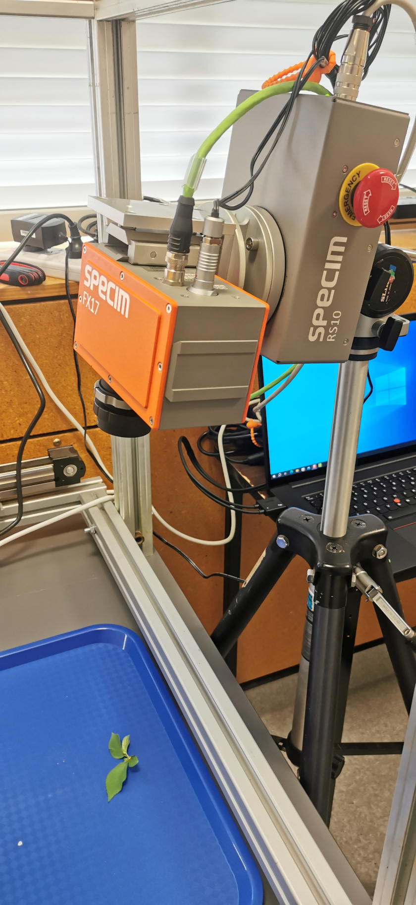

The hyperspectral imaging hardware available:

* [Specim FX17](https://www.specim.com/products/specim-fx17/) camera operates 
  in the near-infrared region, with free wavelength selection from 224 bands 
  within the camera coverage.
* [Specim RS10](https://www.specim.com/products/rs10-rotary-stage/) rotary 
  stage scanner allows scanning an image of a stationary target or scenery 
  in the lab and field.

# Manuals

* [Specim FX17 User Manual](img/fx17-user-manual.pdf)
* [Specim RS10 User Guide](img/rotating-stage-10-user-guide-v1.0.pdf)
* [LUMO Scanner](img/lumo_scanner.pdf)

# Setup

