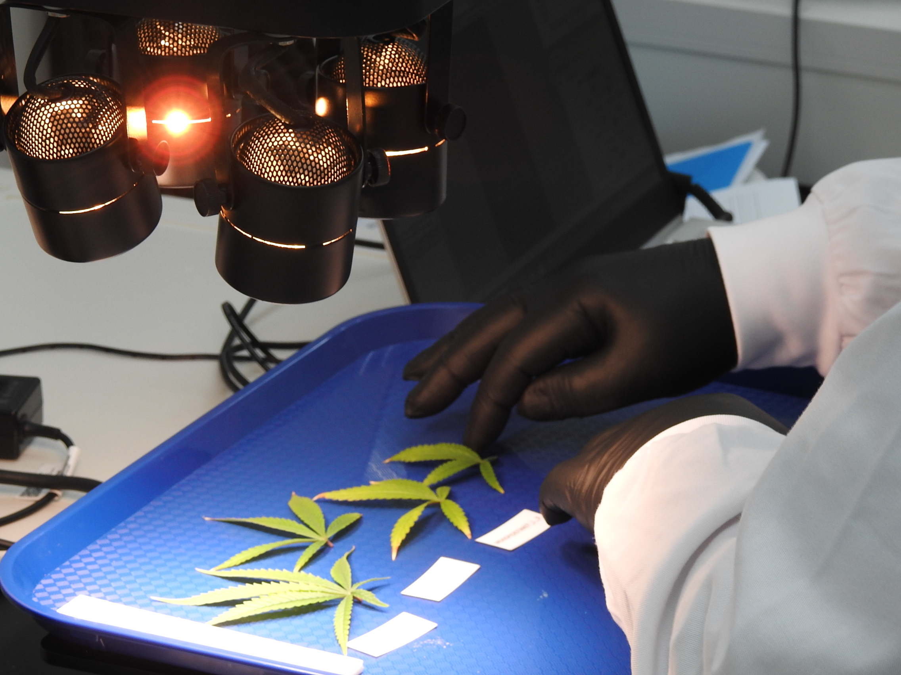

Welcome to the Hyperspectral Imaging Group at the University of Waikato. We are a team of engineers and computer scientists dedicated to advancing the  hyperspectral imaging (HSI) technology through open-source platforms, software-hardware integration, machine learning and AI-informed image acquisition protocols. Our group serves as a hub for collaboration, exploration, and discovery in the hyperpectral imaging field.

HAPPy Software:
At the core of our research is the HAPPy software, which is abbreviation for Hyperspectral Applications Platform in Python. This is a groundbreaking platform that streamlines hyperspectral data acquisition, annotation, analysis, and the exploration of machine learning algorithms. HAPPy empowers researchers to bridge the gap between hyperspectral data and state-of-the-art machine learning algorithms, facilitating quicker experimentation and innovation in HSI.

Our Hardware:
We employ state-of-the-art hardware, including hyperspectral cameras and rotary stages, to capture high-quality hyperspectral data. Our hardware setup is carefully designed to ensure precision and accuracy in data acquisition, providing a solid foundation for our research endeavors.

Publications:
Our commitment to excellence in hyperspectral imaging research is reflected in our publications. Explore our publications to gain insights into our latest findings and contributions to the field.
